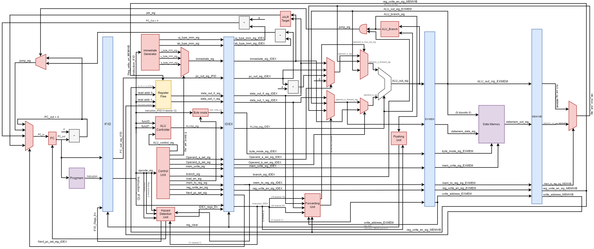
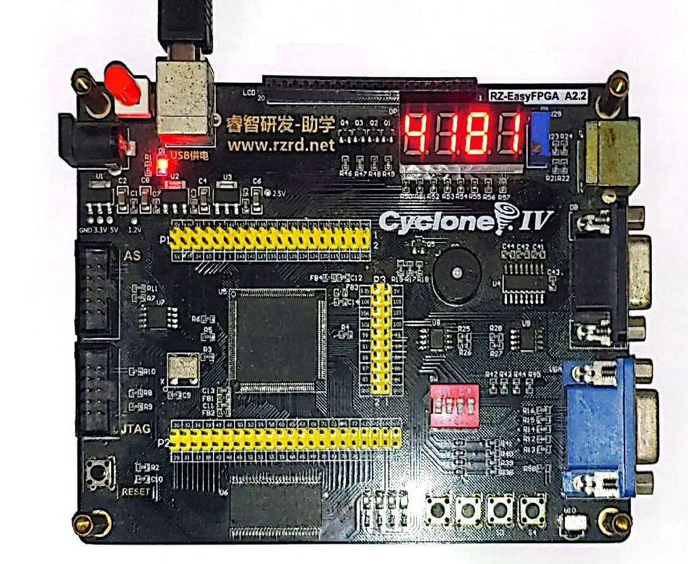

# RISC-V-Pipelined-VHDL

This project contains a Five-Stage Pipelined RISC-V processor that can run all the RV32I ISA instructions beside ECALL, CSSR, and FENCE. The soft processor core was made for my undergraduate final project. Related works: Maestro soft processor core, the Computer Organization and Design textbook by Patterson and Hennessy, and my previous Single-Cycle RV32I soft processor core.

We propose a RISC-V soft processor with a five-stage pipelining for educational purposes. We implemented this processor core in VHDL Hardware Description Language and verified the logic using ModelSim. Then, we evaluated the resource usage, critical path, and maximum frequency compared to our previous single-cycle design and other soft processors. The processor core could run the test program when we run it on an EP4CE6E22C FPGA board.

The testing result shows that the proposed soft processor with five-stage pipelining runs around 37% faster than our previous single-cycle design. Despite the increase in throughput, we believe that we can improve this design further. We consider this improvement to be insignificant. The critical path that includes the datapath from MEM/WB register, ALU multiplexer, ALU, Branching unit, PC Multiplexer, and PC is probably the cause of this bottleneck. We can improve the maximum frequency of the proposed processor core by balancing the long combinational path of that critical path.

